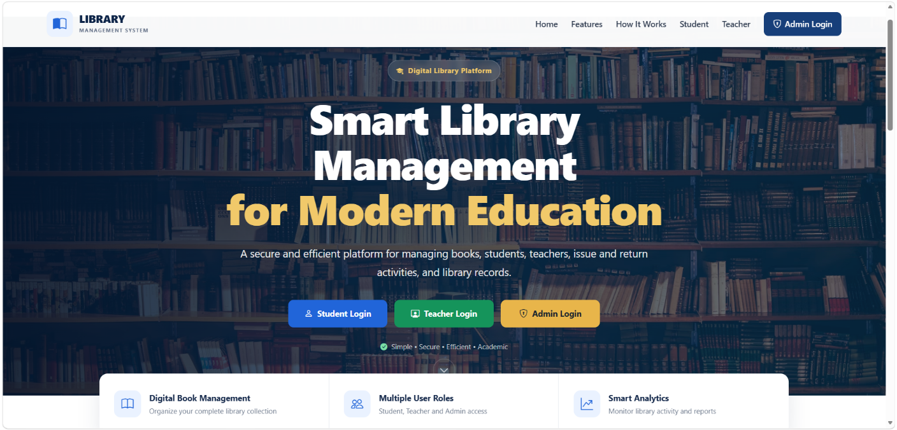
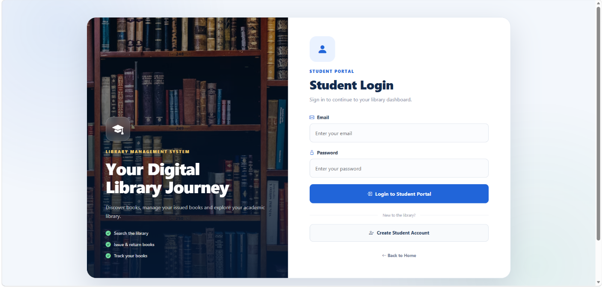
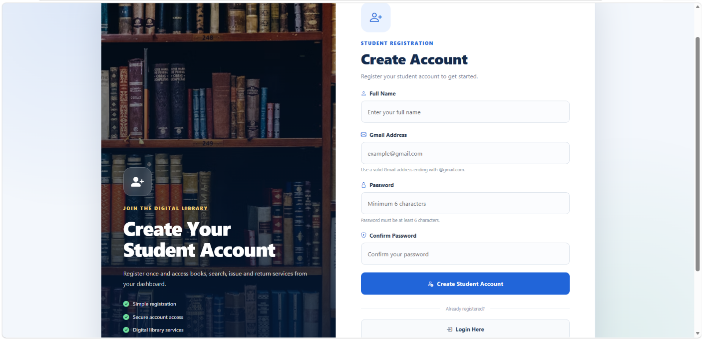

# 📚 Smart Library Management System

A Flask-based web application for managing library operations with **role-based access, book management, user authentication, issue/return tracking, search functionality, dashboards, and SQLite database integration**.

---

## 📌 Project Overview

The **Smart Library Management System** is a web-based application developed using Python and Flask to simplify common library management activities.

The system provides separate functionality for users, teachers, and administrators, allowing books, users, and library transactions to be managed efficiently through a centralized web interface.

The project demonstrates practical implementation of:

- User authentication
- Role-based access control
- Book catalogue management
- Book issue and return tracking
- Search functionality
- Dashboard-based management
- SQLite database integration
- Responsive web interface
- Library reports and records

---

## ✨ Features

### 🔐 User Authentication

The system provides authentication functionality for registered users.

Users can:

- Register a new account
- Log in using their credentials
- Access features according to their role
- Manage their profile
- Change their password
- Log out securely

Passwords are stored using password hashing rather than plain-text storage.

---

### 👥 Role-Based Access

The application supports role-based access for different types of users.

Different roles can access different features according to their permissions.

This helps prevent unauthorized access to administrative and management functionality.

---

### 📚 Book Catalogue

The book catalogue allows users to view and search available books.

The system maintains information such as:

- Book title
- Author
- ISBN
- Category
- Availability
- Book details

Users can search the catalogue to find books more easily.

---

### 📖 Book Issue & Return

The system supports library book transaction management.

Library operations include:

- Issuing books
- Recording issued books
- Returning books
- Tracking book availability
- Maintaining issue history
- Viewing issued books

This reduces the need for manual record keeping.

---

### 🔎 Book Search

The application provides a search system for quickly finding books.

Users can search books using available information such as:

- Book title
- Author
- ISBN
- Category

---

### 📊 Dashboard

The application provides dashboards for managing and monitoring library activities.

The dashboard can be used to view important information such as:

- Books
- Students
- Teachers
- Issued books
- Library activity
- Reports

---

### 📝 Reports

The system provides report-related functionality for monitoring library records.

Reports can be used to track:

- Issued books
- Returned books
- Student records
- Teacher records
- Library transactions

---

### 🗄️ SQLite Database

The application uses **SQLite** for local database management.

The database stores information related to:

- Users
- Students
- Teachers
- Books
- Library transactions
- Issue and return records

Database operations are handled through Python modules to keep the application organized.

---

## 🖥️ Screenshots

### 🏠 Home Page



---

### 🔐 User Login



---

### 📝 User Registration



---

### 📚 Book Catalogue


---

## 🛠️ Technologies Used

| Technology | Purpose |
|------------|---------|
| **Python** | Backend application development |
| **Flask** | Web application framework |
| **SQLite** | Database management |
| **HTML** | Web page structure |
| **CSS** | User interface styling |
| **Bootstrap** | Responsive UI components |
| **Jinja2** | Dynamic HTML templates |
| **Werkzeug** | Password hashing and security |
| **Gunicorn** | Production WSGI server |

---

## 🏗️ Application Architecture

The application follows a Flask-based web architecture.

```text
                    ┌─────────────────────┐
                    │      Web Browser    │
                    └──────────┬──────────┘
                               │
                               ▼
                    ┌─────────────────────┐
                    │     Flask App       │
                    │       app.py        │
                    └──────────┬──────────┘
                               │
              ┌────────────────┼────────────────┐
              │                │                │
              ▼                ▼                ▼
       ┌─────────────┐  ┌─────────────┐  ┌─────────────┐
       │Authentication│  │ Book Module │  │  Dashboard  │
       └─────────────┘  └─────────────┘  └─────────────┘
              │                │                │
              └────────────────┼────────────────┘
                               ▼
                    ┌─────────────────────┐
                    │   SQLite Database   │
                    └─────────────────────┘
